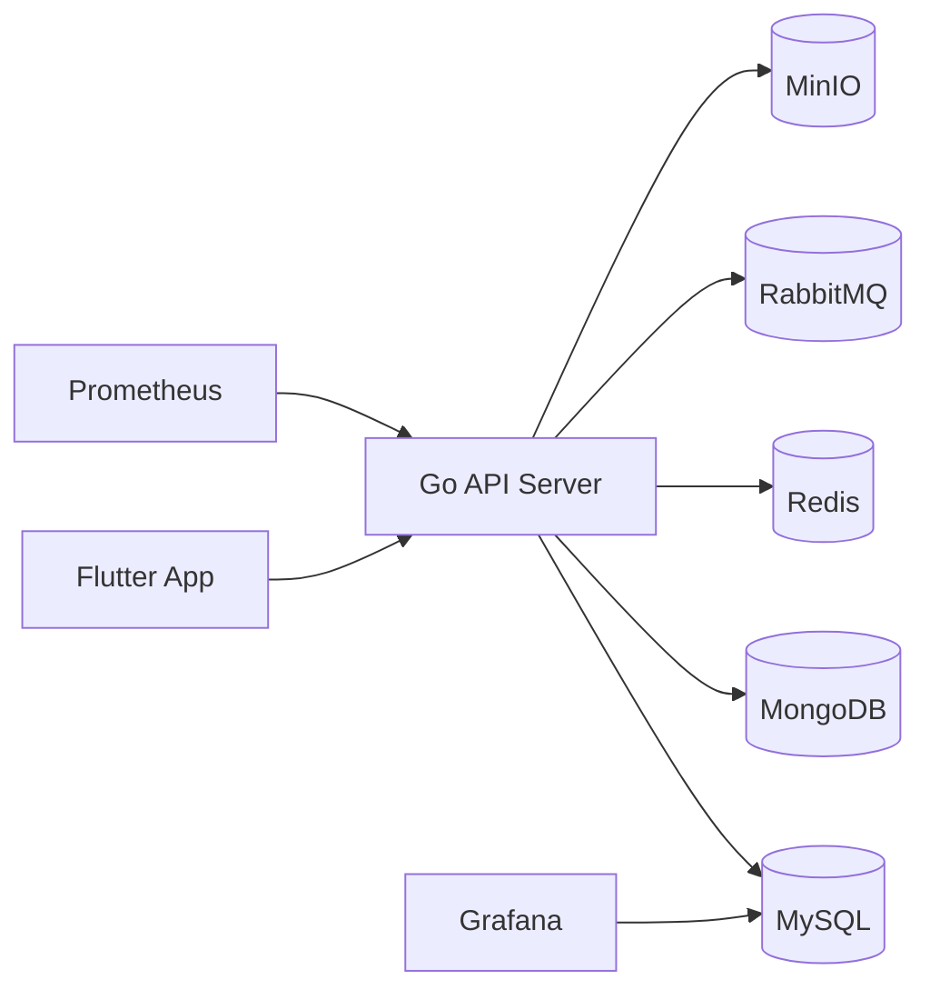



# MoocHub

湖北大学计算机专业毕业设计项目（Flutter + Go）

[服务端 README](server/README.md) | [客户端 README](flutter_app/README.md) | [文档索引](doc/README.md) | [更新日志](CHANGELOG.md)

面向“中国大学 MOOC”风格的在线学习社区（移动端为主）。支持课程浏览、视频播放、评论互动、收藏与学习进度。

## 核心能力
- 多端学习体验：课程浏览、视频播放、评论互动、收藏和学习进度
- 推荐与运营能力：埋点看板、推荐系统、缓存预热、热点保护
- 稳定性工程：限流、熔断、重试、幂等、结构化日志与 trace
- 客户端体验：离线缓存、弱网重试、统一骨架屏/空态
- 工程协作：CI/CD、PR 流程、版本管理、Release 产物

## 系统架构图

## 项目状态
- 当前版本：1.0（功能冻结）
- 后续仅进行稳定性与文档维护，不再新增功能

## 目录结构
- `flutter_app/`：Flutter 客户端
- `server/`：Go 服务端
- `doc/`：技术文档（索引见 `doc/README.md`）
- 根目录：数据库结构与数据转储文件（仅结构 / 结构+数据）
- `results/`：测试结果摘要与统计（详情见 `results/README.md`）

## 快速开始
- 服务端：见 `server/README.md`
- 客户端：见 `flutter_app/README.md`

## 贡献与协作
- 分支规范：`feat/*`、`fix/*`、`docs/*`、`chore/*`
- 合并前建议通过：`CI Check / flutter-check`、`CI Check / server-check`

## 贡献者

